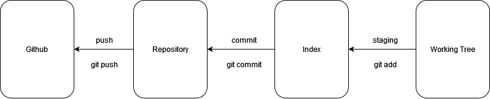

# git

## インストール

https://git-scm.com/download/win

## バージョン管理とは

プログラムを制作しているとファイルを以前の状態に戻したいことがよくあります。gitでは以前の状態を保存しておくことができ、コマンド一つで以前の状態に戻すことができます。

ファイルの状態を保存する場所を「リポジトリ」といいます。また、リポジトリ保存されている過去の状態を「コミット」といいます。リポジトリ内のコミットを行き来することで、ファイルを以前の状態に戻すことができます。

## レポジトリを作る

レポジトリを作るには次のコマンドを用います。

```shell
git init
```

## コミットを作る

コミットを作るには次の２つのコマンドを用います。

```shell
git add <files>
git commit -m <message>
```

まず、`git add`でコミットに含めるファイルを指定します。次に、`git commit`でコミットを作ります。コミットを作るときには、メッセージを付ける必要があります。

`git add`でコミットに含めるように指定することを「ステージング」といいます。また、ステージング前のファイルは「ワーキングツリー」にあるといい、ステージングされたファイルは「インデックス」にあるといいます。

## Githubにアップロードする

Githubのレポジトリに変更内容をアップロードするには、まずレポジトリを複製します。

```shell
git clone <url>
```

次に、変更内容のコミットを作ります。

```shell
git add <files>
git commit -m <message>
```

最後に、変更内容をアップロードします。この操作をプッシュといいます。

```shell
git push
```


