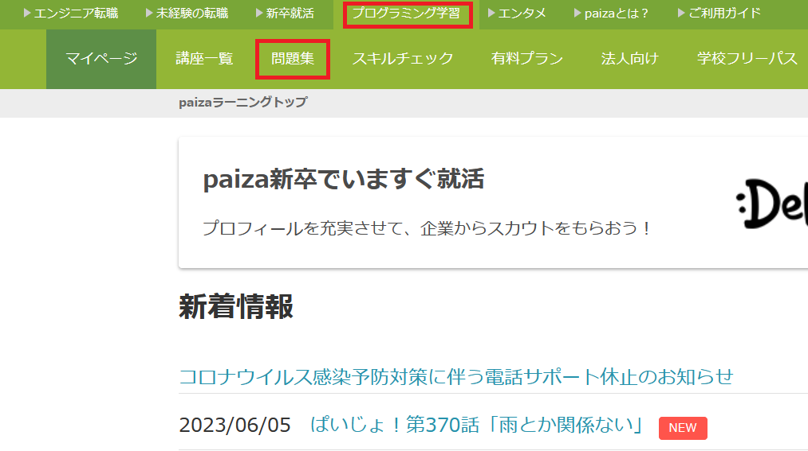

# 競技プログラミング

プログラミングによって問題を早く正確に解く能力を競う競技です。

## Paiza

競技プログラミングの第一歩として、Paizaというサイトで練習していきます。

https://paiza.jp/works/mypage



アカウントを作成して、

プログラミング学習 -> 問題集

を開いてください。

## 入出力

競技プログラミングでは`標準入力`から問題の条件を読み込み、`標準出力`へと答えを出力します。

標準入力からの読み込みは、`input()`関数で行います。

```python
x = input() # 標準入力から値を読み込み、変数xに代入
```

標準出力への出力は、`print()`関数で行います。

```python
print(x) # 変数xの値を、標準出力へと出力
```

## 型の変換

標準入力は常に文字列として読み込まれます。そのため、数値を読み込むときは、一旦文字列として読み込んだ後、数値に変換する必要があります。

文字列から整数への変換は`int()`関数、小数への変換は`float()`関数を使います。

```python
x = int(input()) # 標準入力から整数を読み込む
```

## 複数の値の読み込み

競技プログラミングでは、複数の値を標準入力から読み込む場合があります。そのとき、複数の値が一行ずつ渡される場合は、`input()`関数を複数回呼び出すことで読み込めます。

```
100
200
```

```python
x = input() # 100
y = input() # 200
```

一方、一行に空白区切りで入力される場合もあります。そのときは、`split()`関数で値を分割して読み込みます。

```
100 200
```

```python
ls = input().split()
x = ls[0] # 100
y = ls[1] # 200
```

## 複数の値の出力

競技プログラミングでは、複数の値を出力する場合があります。一行ずつ出力が求められる場合は、`print()`関数を複数回呼び出します。

```python
print("hello")
print("world")
```

```
hello
world
```

一行に複数の値をまとめて出力することを求められることもあります。そのときは、`print()`関数の引数に出力したい値をまとめて渡します。

```python
print("hello", "world")
```

```
hello world
```

空白区切りで出力されることに注意してください。
