<link rel="stylesheet" href="default.css" type="text/css">

# 環境構築

## Pythonのインストール

ブラウザで「python install」と検索してPythonのホームページを開きます。

Pythonのホームページにある「Download Python x.x.x」ボタンをクリックして、Pythonのインストーラーをダウンロードします。

>ダウンロード：パソコンにファイルを取り込むこと<br>
>インストール：ソフトウェアを使用できるようにする

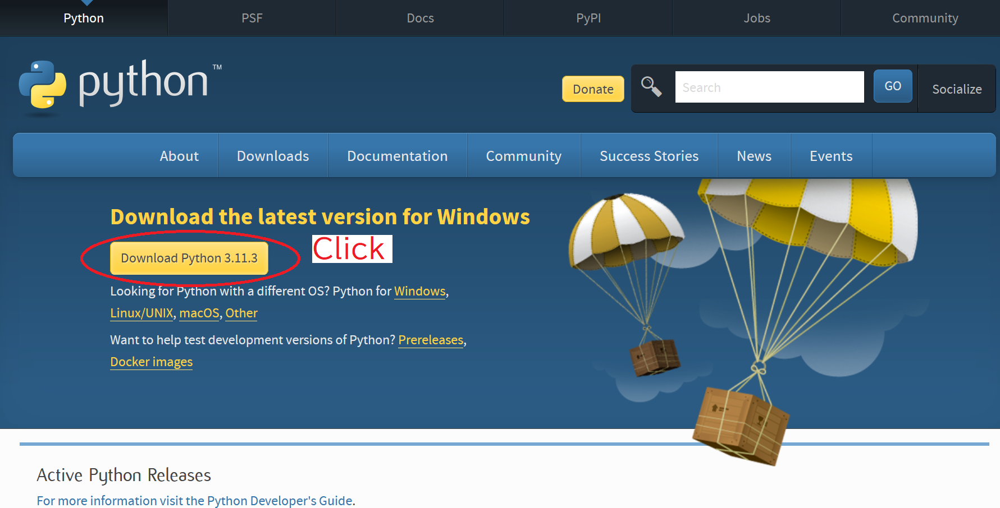

インストーラーをダブルクリックで起動します。「Add python.exe to PATH」という項目に必ずチェックを入れて、「Install Now」ボタンを押します。

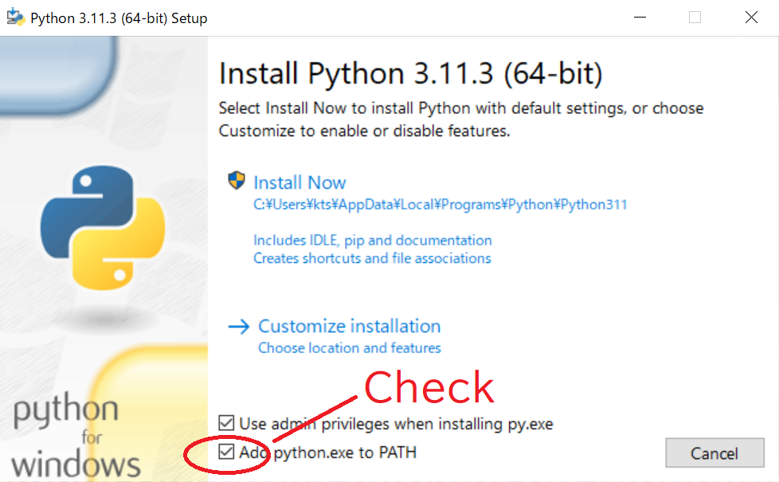

VSCodeを起動して、上部の「Terminal」タブから、「New Terminal」をクリックします。

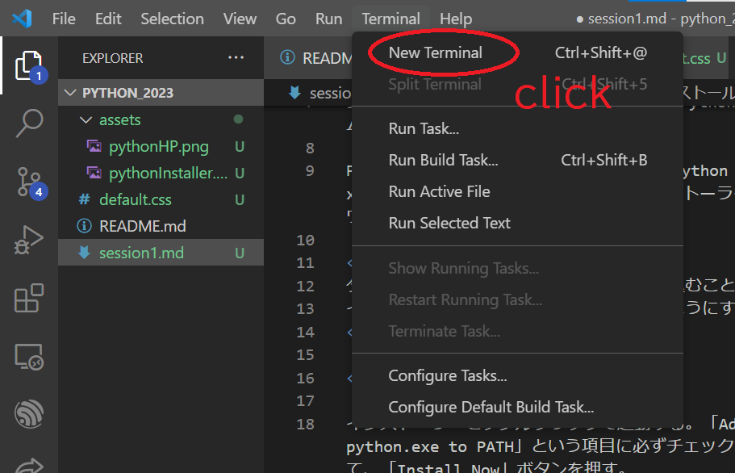

すると、VSCodeの下部に新しくTerminalパネルが開きます。パネル内に、

```
$ python --version
```

と入力して、Enterキーを押します。正しくPythonがインストールできていれば、

```
> python x.x.x
```

と表示されます。

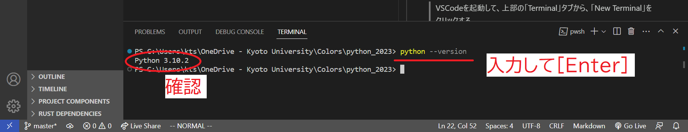

> ターミナルの入力と出力を区別するために、\$と>を使います。<br>
> 入力の場合は、「\$＋空白」の後に入力内容を書きます。<br>
> 出力の場合は、「>＋空白」の後に出力内容を書きます。

## VSCodeのセットアップ

VSCodeでは様々な拡張機能(Extension)を利用できます。今回は、Pythonのプログラムを書くときに便利な拡張機能を導入します。

VSCodeの左側からExtensionボタンをクリックして、拡張機能タブを開きます。検索欄に「python」と入力します。出てきた結果から、Microsoft社が提供している「Python」拡張機能を選びます。

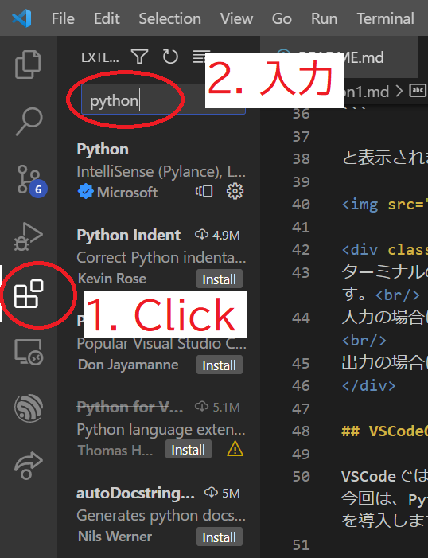

Python拡張機能のページが開くので、「Install」ボタンをクリックして拡張機能をインストールします。

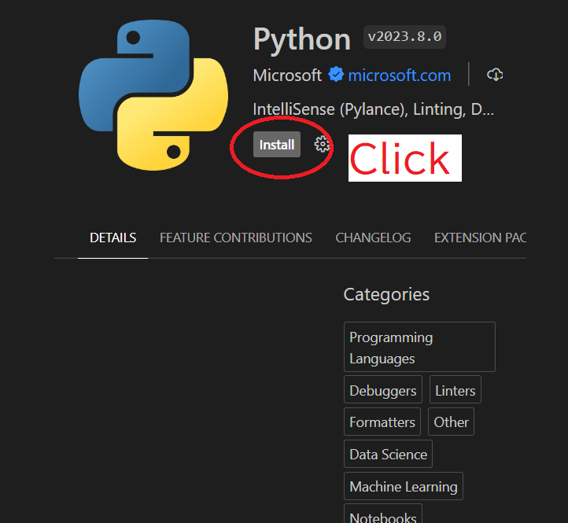

「Uninstall」ボタンが表示されるようになれば、インストール完了です。

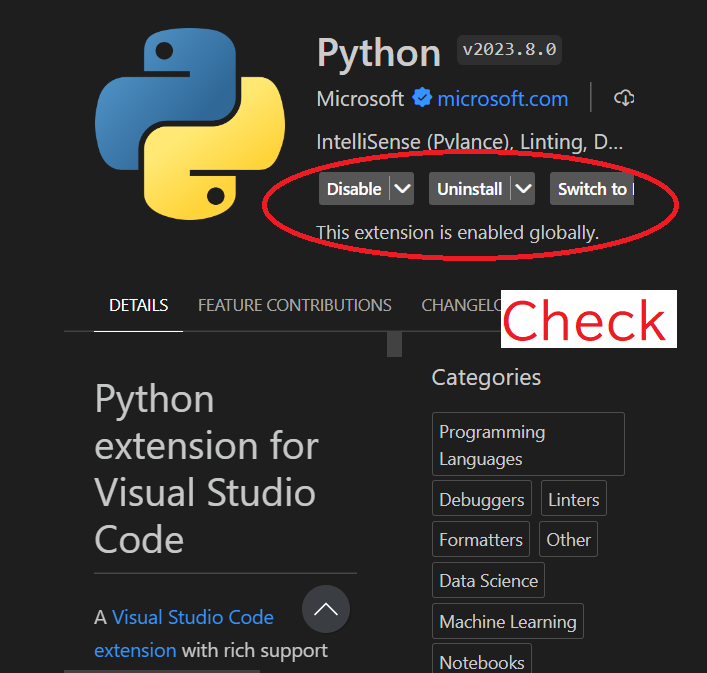

# はじめてのPythonプログラミング

Pythonでプログラミングをする環境は整ったので、実際にプログラムを書いてみます。

## フォルダ作成

これから、Pythonもくもく会で作るプログラムを保存するフォルダを作ってください。場所や名前は何でもOKです。

VSCode上部の「File」タブから、「Open Folder」をクリックして、作成したフォルダを選択して開きます。

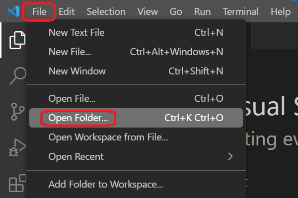

## ファイル作成

プログラムを書くファイルを作ります。

VSCodeの左側にある`Explorer`ボタンをクリックして、エクスプローラータブを開きます。

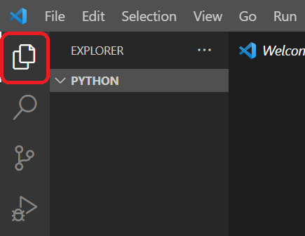

エクスプローラータブ内にカーソルを持ってくると、ファイル作成ボタンとフォルダ作成ボタンが表示されます。

ファイル作成ボタンをクリックして、`hello_world.py`という名前のファイルを作成してください。

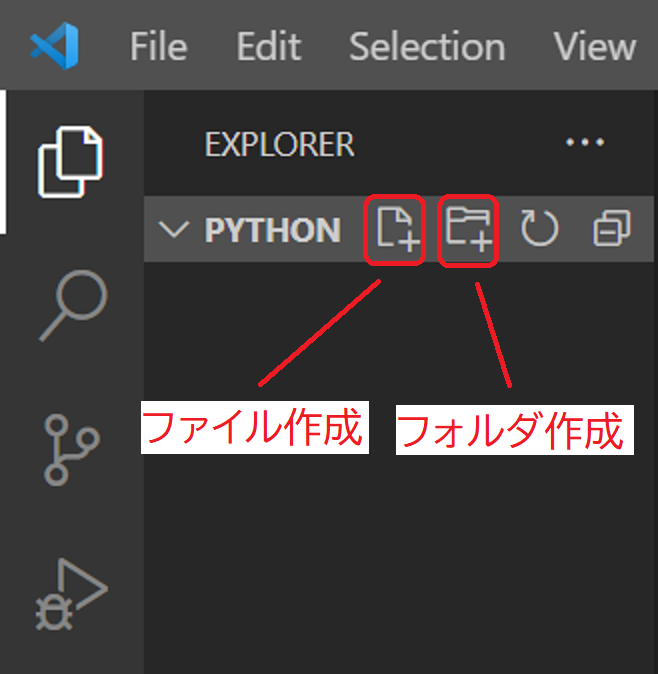

`hello_world.py`をクリックして開き、以下のプログラムを入力して、`[Ctrl]+S`を押して保存します。

```python
print("Hello World!!")

```

ターミナルを開き、

```
$ python hello_world.py
```

を実行すると、

```
> Hello World!!
```

と出力されれば成功です！

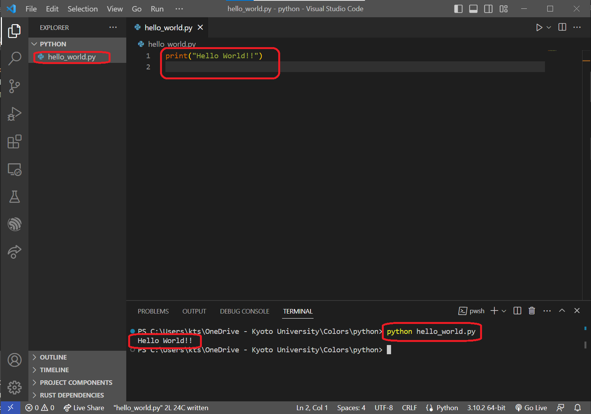

# 今日学んだこと

- VSCodeでのフォルダーの開き方
- VSCodeでのフォルダ・ファイルの作り方
- VSCodeでのファイルの編集
- VSCodeでのターミナルの開き方
